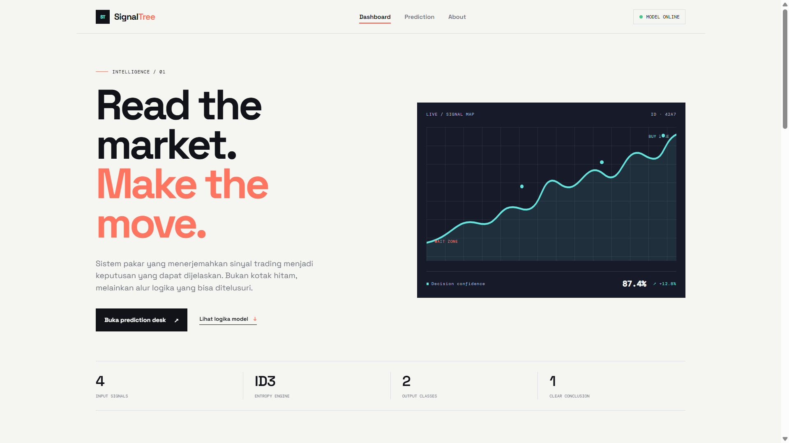
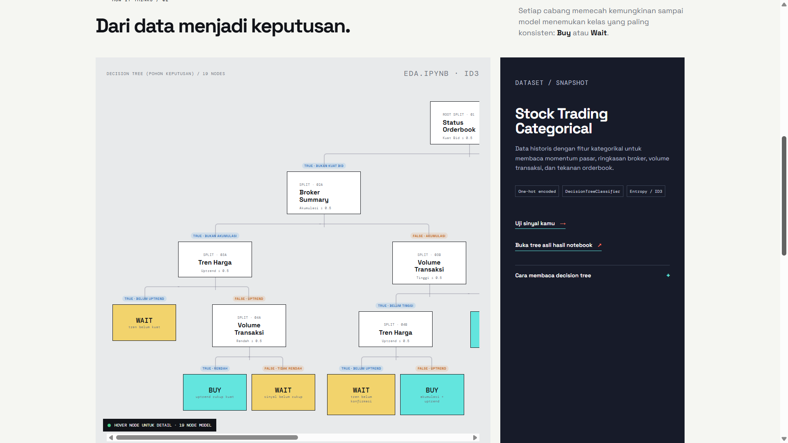
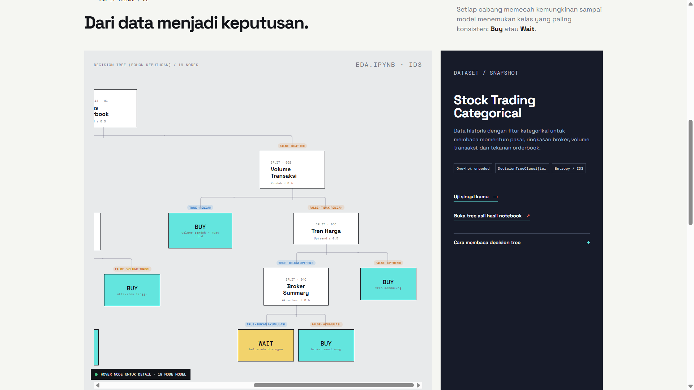
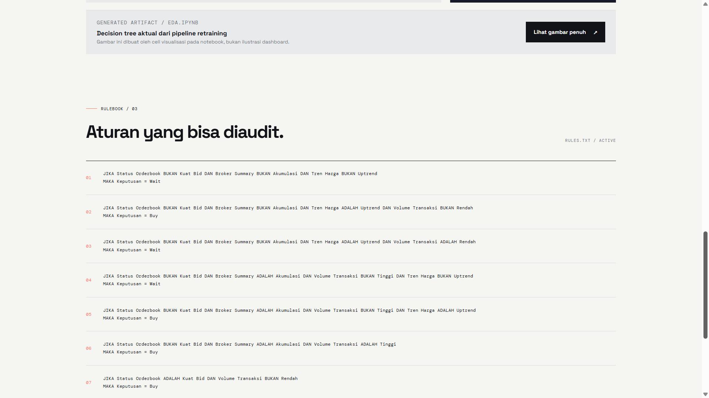
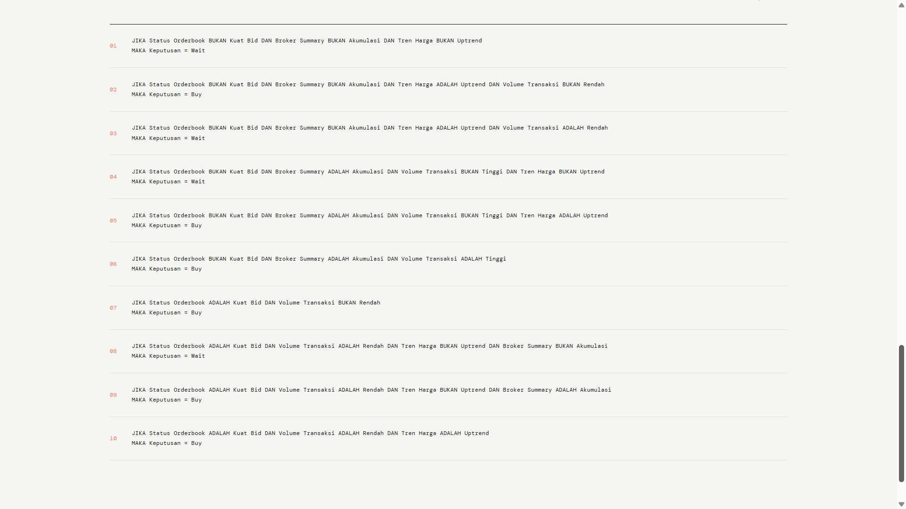
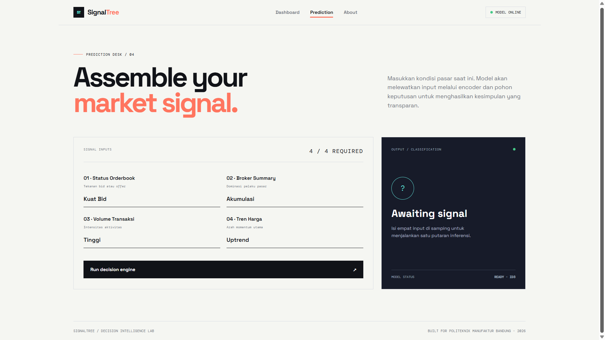
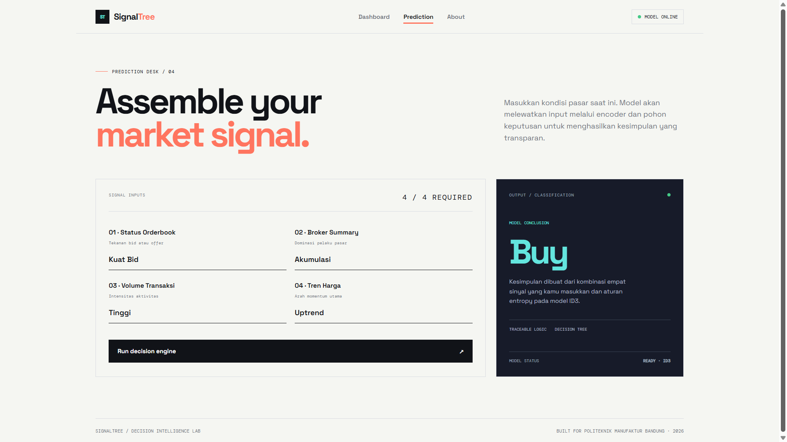
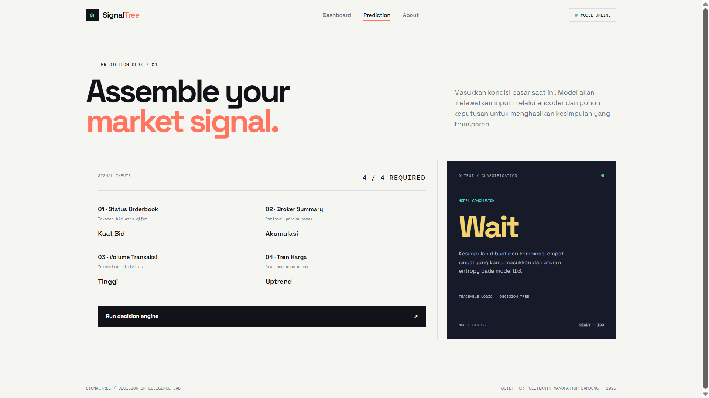
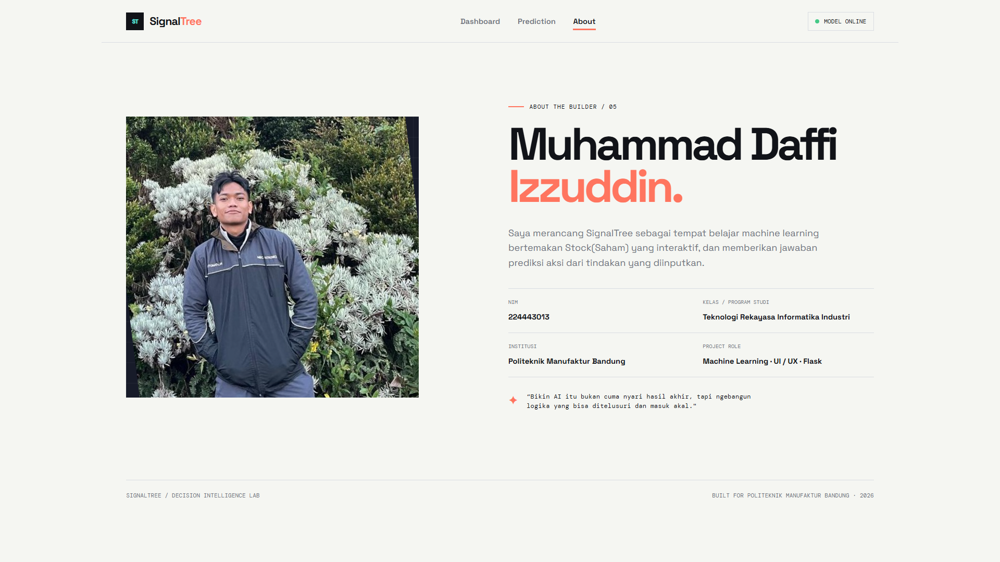
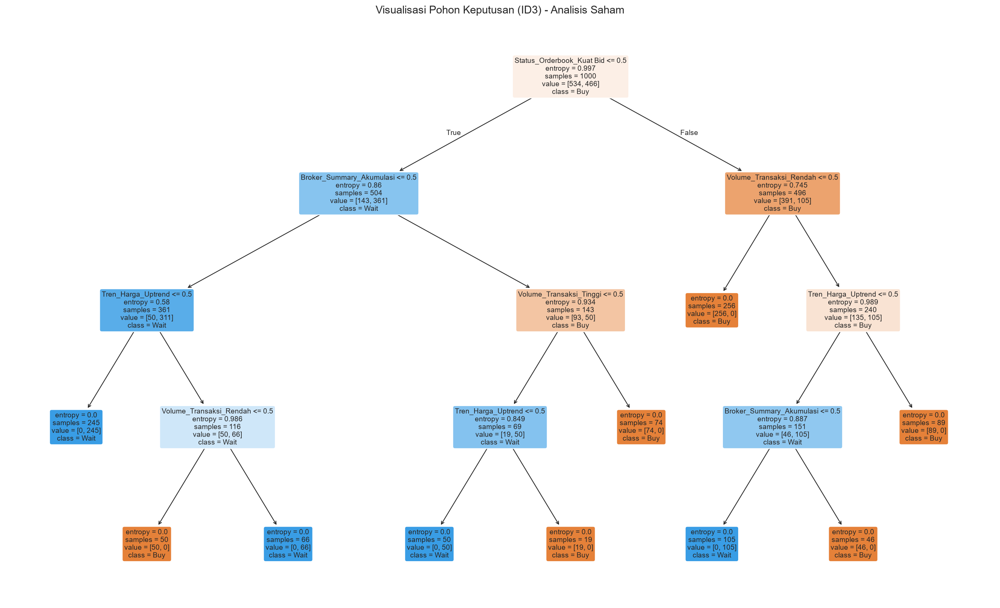

# SignalTree — Expert System for Stock Trading Decisions

  
  
  
  

An explainable **rule-based expert system** that turns four categorical market signals into a single actionable decision: **Buy** or **Wait**.

The knowledge base is not hand-written. It is *learned* from a labelled dataset using an **ID3-style Decision Tree** (`criterion="entropy"`), then extracted back into readable **IF–THEN rules** and served through a **Flask** web interface. The result is a model you can audit: every prediction can be traced node by node from the root of the tree to the leaf.

> Built as a Machine Learning / Expert System coursework project at **Politeknik Manufaktur Bandung** — *Teknologi Rekayasa Informatika Industri*.

---

## Table of Contents

- [Website Preview](#website-preview)
- [Key Features](#key-features)
- [Tech Stack](#tech-stack)
- [Project Structure](#project-structure)
- [Dataset](#dataset)
- [Methodology (KDD Pipeline)](#methodology-kdd-pipeline)
- [Model Results](#model-results)
- [Extracted Knowledge Base](#extracted-knowledge-base)
- [Installation](#installation)
- [Usage](#usage)
- [Application Routes](#application-routes)
- [How to Read the Decision Tree](#how-to-read-the-decision-tree)
- [Limitations & Future Work](#limitations--future-work)
- [Author](#author)
- [Disclaimer](#disclaimer)

---

## Website Preview

### Dashboard — Signal Map & Decision Tree

<p align="center">
  
</p>

<!-- Add more shots of the same page if you want: -->
<!--  -->

### Interactive Decision Tree

<p align="center">
  
  
</p>

### Rulebook — Generated IF–THEN Rules

<p align="center">
  
  
</p>

### Prediction Desk

<p align="center">
  
  
  
</p>

### About Page

<p align="center">
  
</p>

### Generated Artifact — `tree.png`

<p align="center">
  
</p>

<details>
<summary><b>Quick copy-paste template for extra screenshots</b></summary>

```markdown
<p align="center">
  
</p>
```

</details>

---

## Key Features

| # | Feature | Description |
|---|---------|-------------|
| 1 | **Learned knowledge base** | The rule set is induced from data with a Decision Tree rather than written by hand. |
| 2 | **Human-readable rules** | A custom tree traversal converts one-hot splits back into plain-language `JIKA … MAKA …` rules (`rules_human.txt`). |
| 3 | **Interactive tree diagram** | A pure CSS/HTML nested tree on the dashboard, with per-node explanations on hover/focus. |
| 4 | **Real-time inference** | The prediction desk runs the saved scikit-learn pipeline on four form inputs and returns the class instantly. |
| 5 | **End-to-end pipeline artifact** | Encoder + classifier are persisted together in one `mymodel.pkl`, so the web app never has to re-implement preprocessing. |
| 6 | **Reproducible EDA notebook** | `EDA.ipynb` documents every KDD stage from data quality checks to rule extraction. |
| 7 | **Graceful degradation** | If `mymodel.pkl` or `rules_human.txt` is missing, the app still boots and shows an instructive message instead of crashing. |
| 8 | **Responsive UI** | Custom CSS with a design-token palette, editorial typography (Space Grotesk / DM Mono), and mobile breakpoints. |

---

## Tech Stack

**Machine Learning**
- `scikit-learn` — `DecisionTreeClassifier(criterion="entropy")`, `OneHotEncoder`, `Pipeline`, `export_text`, `plot_tree`
- `pandas` / `numpy` — data loading, cleaning, categorical validation
- `matplotlib` / `seaborn` — exploratory plots and tree visualisation
- `joblib` — model serialisation

**Web**
- `Flask` — routing, templating, model serving
- `Jinja2` — `base.html` template inheritance
- Vanilla CSS — no framework, no build step

---

## Project Structure

```
Projek Website Sistem Pakar/
├── EDA.ipynb                                    # Full KDD walkthrough (18 cells)
├── train_model.py                               # Headless retraining script
├── Stock_Trading_Categorical_Dataset_Large.csv  # Working dataset (1,000 rows)
├── Stock_Trading_Categorical_Dataset_Large.original.csv
├── mymodel.pkl                                  # Trained pipeline (encoder + tree)
├── rules.txt                                    # Raw export_text() output
├── rules_human.txt                              # Plain-language IF-THEN rules
├── tree.png                                     # plot_tree() visualisation
│
└── project_flask/
    ├── app.py                                   # Flask entry point, 4 routes
    ├── requirements.txt
    ├── mymodel.pkl                              # Model copy loaded by the app
    ├── tree.png
    ├── static/
    │   ├── style.css                            # ~1,300 lines of custom CSS
    │   └── images/daffi.jpeg
    └── templates/
        ├── base.html                            # Shell: navbar, footer, fonts
        ├── dashboard.html                       # Hero, metrics, tree, rulebook
        ├── prediction.html                      # Input form + result panel
        └── about.html                           # Developer profile
```

---

## Dataset

`Stock_Trading_Categorical_Dataset_Large.csv` — **1,000 rows × 6 columns**, fully categorical, no missing values.

### Features (X)

| Column | Meaning | Categories |
|--------|---------|-----------|
| `Tren_Harga` | Price trend direction | `Uptrend` · `Sideways` · `Downtrend` |
| `Broker_Summary` | Dominant broker behaviour | `Akumulasi` · `Netral` · `Distribusi` |
| `Volume_Transaksi` | Transaction volume level | `Tinggi` · `Rendah` |
| `Status_Orderbook` | Orderbook pressure | `Kuat Bid` · `Kuat Offer` |

### Target (y)

| Column | Categories |
|--------|-----------|
| `Keputusan` | `Buy` · `Wait` |

### Class & Category Distribution

| Column | Distribution |
|--------|--------------|
| `Keputusan` | Buy **534** · Wait **466** |
| `Tren_Harga` | Sideways 349 · Uptrend 340 · Downtrend 311 |
| `Broker_Summary` | Netral 361 · Distribusi 327 · Akumulasi 312 |
| `Volume_Transaksi` | Tinggi 505 · Rendah 495 |
| `Status_Orderbook` | Kuat Offer 504 · Kuat Bid 496 |

The target is close to balanced (53.4 % / 46.6 %), so plain accuracy is a reasonable headline metric here. The `No` index column is dropped before training.

---

## Methodology (KDD Pipeline)

**1. Data Understanding** — shape, dtypes, `df.info()`, descriptive statistics, missing-value audit.

**2. Data Validation** — every column is checked against an explicit `valid_categories` dictionary so that typos or unexpected labels surface before modelling.

**3. Data Cleaning** — rows with a missing target are dropped; missing feature values are imputed with the column mode. An `assert` guards that zero nulls remain before the next stage.

**4. Selection** — the four predictor columns plus the target are isolated into `df_saham_selected`; the `No` column is discarded.

**5. Transformation** — `OneHotEncoder(sparse_output=False)` expands the four categorical features into 10 binary columns. This is required because scikit-learn's tree implementation works on numeric splits.

**6. Modelling** — `DecisionTreeClassifier(criterion="entropy", random_state=42)`. The entropy criterion together with information-gain splitting is what makes this an **ID3-style** tree.

- *Evaluation run:* 80 / 20 `train_test_split` on the encoded matrix.
- *Production run:* the model is retrained on **100 % of the data** and wrapped in a `Pipeline([("preprocessor", encoder), ("classifier", classifier)])`, then dumped to `mymodel.pkl`. Packaging the encoder inside the pipeline means `app.py` can pass a raw, human-readable DataFrame straight to `.predict()`.

**7. Knowledge Extraction** — two representations are generated:
- `export_text()` → `rules.txt` (raw one-hot thresholds)
- a custom recursive `_tree` traversal → `rules_human.txt` (splits the one-hot column name back into *category* + *value* and emits `JIKA … DAN … MAKA Keputusan = …`)

**8. Deployment** — Flask loads the pickle at import time and renders the rules and predictions in the browser.

---

## Model Results

### Evaluation on the 20 % hold-out set (200 rows)

```
Accuracy: 100.00%

=== Classification Report ===
              precision    recall  f1-score   support

         Buy       1.00      1.00      1.00       101
        Wait       1.00      1.00      1.00        99

    accuracy                           1.00       200
   macro avg       1.00      1.00      1.00       200
weighted avg       1.00      1.00      1.00       200
```

> **Read this honestly.** A perfect score means the labels in this dataset are a *deterministic function* of the four features — the decision tree recovered the exact generating logic. That is an excellent outcome for an **expert-system knowledge-acquisition** task, which is what this project is. It is **not** evidence that the model predicts real markets; real price action is noisy, non-stationary, and driven by far more than four categorical signals.

### Feature Importance (final retrained tree)

| Feature (one-hot) | Importance |
|-------------------|-----------:|
| `Tren_Harga_Uptrend` | 0.2579 |
| `Volume_Transaksi_Rendah` | 0.2473 |
| `Broker_Summary_Akumulasi` | 0.2253 |
| `Status_Orderbook_Kuat Bid` | 0.1943 |
| `Volume_Transaksi_Tinggi` | 0.0752 |

Tree size: **19 nodes**, of which **10 are leaves** → **10 decision rules**. Root split: `Status_Orderbook_Kuat Bid`.

---

## Extracted Knowledge Base

`rules.txt` — machine format:

```
|--- Status_Orderbook_Kuat Bid <= 0.50
|   |--- Broker_Summary_Akumulasi <= 0.50
|   |   |--- Tren_Harga_Uptrend <= 0.50
|   |   |   |--- class: Wait
|   |   |--- Tren_Harga_Uptrend >  0.50
|   |   |   |--- Volume_Transaksi_Rendah <= 0.50
|   |   |   |   |--- class: Buy
...
```

`rules_human.txt` — the 10 rules rendered on the dashboard (Indonesian, as produced by the extractor):

| # | Rule | Decision |
|---|------|----------|
| 01 | Orderbook ≠ Kuat Bid **and** Broker ≠ Akumulasi **and** Tren ≠ Uptrend | **Wait** |
| 02 | Orderbook ≠ Kuat Bid **and** Broker ≠ Akumulasi **and** Tren = Uptrend **and** Volume ≠ Rendah | **Buy** |
| 03 | Orderbook ≠ Kuat Bid **and** Broker ≠ Akumulasi **and** Tren = Uptrend **and** Volume = Rendah | **Wait** |
| 04 | Orderbook ≠ Kuat Bid **and** Broker = Akumulasi **and** Volume ≠ Tinggi **and** Tren ≠ Uptrend | **Wait** |
| 05 | Orderbook ≠ Kuat Bid **and** Broker = Akumulasi **and** Volume ≠ Tinggi **and** Tren = Uptrend | **Buy** |
| 06 | Orderbook ≠ Kuat Bid **and** Broker = Akumulasi **and** Volume = Tinggi | **Buy** |
| 07 | Orderbook = Kuat Bid **and** Volume ≠ Rendah | **Buy** |
| 08 | Orderbook = Kuat Bid **and** Volume = Rendah **and** Tren ≠ Uptrend **and** Broker ≠ Akumulasi | **Wait** |
| 09 | Orderbook = Kuat Bid **and** Volume = Rendah **and** Tren ≠ Uptrend **and** Broker = Akumulasi | **Buy** |
| 10 | Orderbook = Kuat Bid **and** Volume = Rendah **and** Tren = Uptrend | **Buy** |

**Plain-English summary of the learned logic:** strong bid pressure combined with meaningful volume is almost always enough to trigger *Buy*. Without strong bid pressure, the system waits for at least two confirming signals — broker accumulation, an uptrend, or high volume. A lone signal is never sufficient.

---

## Installation

### Prerequisites
- Python **3.9+**
- `pip`

### Steps

```bash
# 1. Clone
git clone https://github.com/<your-username>/<your-repo>.git
cd "Projek Website Sistem Pakar"

# 2. Create and activate a virtual environment
python -m venv .venv

# Windows
.venv\Scripts\activate
# macOS / Linux
source .venv/bin/activate

# 3. Install dependencies
pip install -r project_flask/requirements.txt

# For the notebook as well:
pip install numpy matplotlib seaborn scipy notebook
```

`project_flask/requirements.txt`:

```
Flask
pandas
joblib
scikit-learn
```

> **Version note:** the pinned versions in the repo reflect the machine the project was built on. `mymodel.pkl` is a pickle, so it must be loaded with a scikit-learn version compatible with the one that created it. If you see an unpickling warning or error, just regenerate the model with `python train_model.py`.

---

## Usage

### A. Retrain the model (optional)

```bash
python train_model.py
```

This regenerates `mymodel.pkl`, `rules.txt`, and `tree.png` in the project root. Copy the fresh `mymodel.pkl` into `project_flask/` so the web app picks it up.

For the full pipeline including `rules_human.txt`, run `EDA.ipynb` top to bottom instead — the human-readable rule extractor lives in the notebook.

### B. Run the web app

```bash
cd project_flask
python app.py
```

Then open **http://127.0.0.1:5000**.

### C. Make a prediction programmatically

```python
import joblib, pandas as pd

model = joblib.load("project_flask/mymodel.pkl")

sample = pd.DataFrame({
    "Tren_Harga":       ["Uptrend"],
    "Broker_Summary":   ["Akumulasi"],
    "Volume_Transaksi": ["Tinggi"],
    "Status_Orderbook": ["Kuat Bid"],
})

print(model.predict(sample)[0])   # -> 'Buy'
```

No manual encoding needed — the `OneHotEncoder` is the first step of the pipeline.

---

## Application Routes

| Route | Method | Template | Purpose |
|-------|--------|----------|---------|
| `/` | GET | `dashboard.html` | Hero signal map, metric strip, interactive decision tree, and the rulebook read live from `rules_human.txt`. |
| `/prediksi` | GET, POST | `prediction.html` | Four dropdown inputs; on POST the pipeline predicts and the result panel renders `Buy` or `Wait` with class-specific styling. |
| `/tree-image` | GET | — | Streams the generated `tree.png` via `send_file` with `max_age=0` so a retrained tree shows up immediately. |
| `/tentang` | GET | `about.html` | Developer profile and project motivation. |

**Path resolution:** `app.py` uses `Path(__file__).resolve().parent` as `BASE_DIR`. The model is read from `BASE_DIR`, while `rules_human.txt` and `tree.png` are read from `BASE_DIR.parent` (the project root). Keep that layout intact when deploying, or adjust the two paths.

---

## How to Read the Decision Tree

1. Start at the **root node** at the top: `Status Orderbook — Kuat Bid ≤ 0.5`.
2. Because the features are one-hot encoded, a threshold of `≤ 0.5` means **"this category is NOT present"**, and `> 0.5` means **"this category IS present"**.
3. Follow the branch matching your market condition.
4. Stop when you reach a coloured leaf: **BUY** or **WAIT**. White/blue boxes are features being tested; coloured boxes are conclusions.

On the dashboard, hovering or keyboard-focusing any node reveals a short explanation of what that split decides. The diagram scrolls horizontally on narrow screens.

---

## Limitations & Future Work

**Current limitations**
- **Perfect accuracy signals a synthetic, rule-generated dataset**, not real market skill. Treat the metric as validation that the knowledge extraction worked.
- The tree is grown **unpruned** (no `max_depth`, no `min_samples_leaf`). It happens to stay small here, but on noisier data it would overfit.
- No **cross-validation** or confusion-matrix plot; a single 80/20 split is the whole evaluation.
- Only **two output classes** — there is no `Sell` decision.
- Predictions return a **class label only**, with no probability or confidence score.
- The tree diagram in `dashboard.html` is **hard-coded HTML**; retraining the model does not update it automatically (only `rules_human.txt` and `tree.png` refresh).
- Some branch labels in the hard-coded diagram describe the `≤ 0.5` side as if the category were present — worth re-checking against `rules.txt` before a demo.
- No input validation beyond HTML `required`, no tests, no logging.

**Roadmap**
- [ ] Render the tree dynamically from the pickle so the UI can never drift from the model
- [ ] Add `predict_proba()` and show a confidence bar on the result panel
- [ ] Stratified k-fold CV + confusion matrix and a precision/recall chart on the dashboard
- [ ] Hyperparameter search over `max_depth` / `min_samples_leaf` and a pruning comparison
- [ ] Compare against Random Forest, Naive Bayes, and a classic forward-chaining rule engine
- [ ] Introduce a third `Sell` class and add indicators (RSI, MA crossover, foreign net flow)
- [ ] A `/history` page storing past queries, plus a JSON API endpoint
- [ ] Dockerfile and a production WSGI server (gunicorn/waitress) instead of `debug=True`
- [ ] Unit tests for rule extraction and route smoke tests

---

## Live Demo

This application is officially deployed and hosted on **PythonAnywhere**. You can explore the dashboard, view the extracted rulebook, and try the Prediction Desk directly from your browser without any local installation:

👉 **[Try SignalTree Live on PythonAnywhere](https://daffi.pythonanywhere.com/)**

> **Note:** If you are visiting for the first time in a while, the app might take a few seconds to wake up.

## Author

**Muhammad Daffi Izzuddin**
NIM 224443013 · Teknologi Rekayasa Informatika Industri
Politeknik Manufaktur Bandung

Role: Machine Learning · UI/UX · Flask development

> *"Building AI isn't just about chasing a final answer — it's about constructing logic you can trace and that actually makes sense."*

---

## Disclaimer

This project is built for **academic and educational purposes only**. It is a demonstration of decision-tree-based knowledge acquisition for an expert system, trained on a categorical dataset — not a financial product. Nothing produced by this application is investment advice. Do your own research and consult a licensed professional before making any trading decision.
